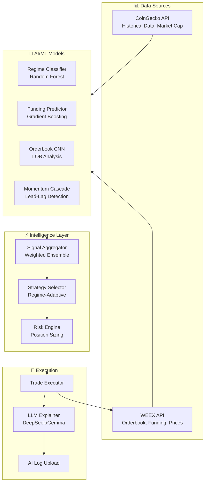
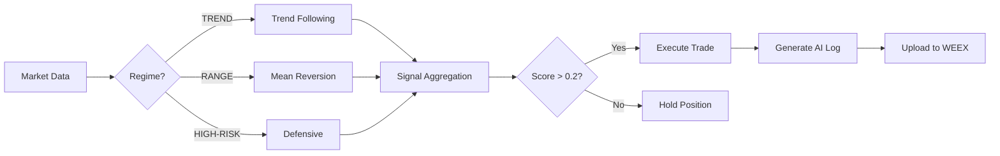
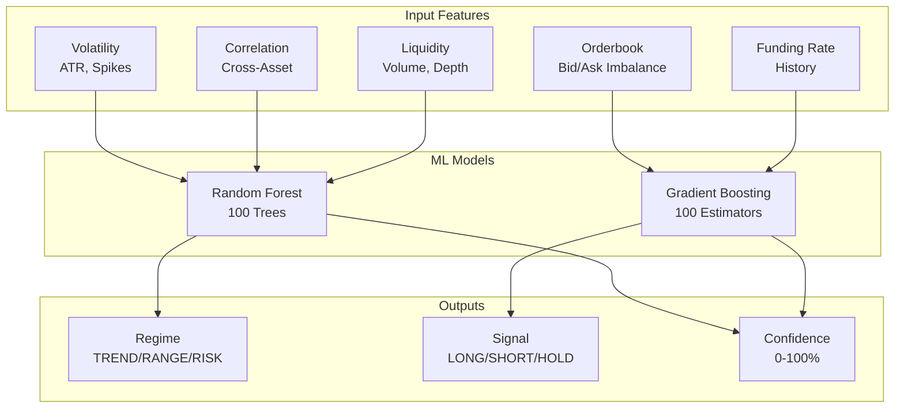

# 🏆 Crypto Alpha Intelligence Engine

<p align="center">
  
</p>

<p align="center">
  <strong>AI-Powered Trading System for WEEX AI Wars Hackathon</strong>
</p>

<p align="center">
  
  
  
  
  
</p>

<p align="center">
  <a href="public/Crypto_Alpha_Intelligence_Engine.mp4">
    
  </a>
</p>

---

## 🎬 Demo Video

https://github.com/user-attachments/assets/Crypto_Alpha_Intelligence_Engine.mp4

> **Note**: Click the video above or [download the demo video](public/Crypto_Alpha_Intelligence_Engine.mp4) to see the system in action.

---

## 🎯 What This Project Does

A comprehensive **AI-powered cryptocurrency trading system** designed for the **WEEX AI Wars: Alpha Awakens** hackathon. The system uses multiple novel AI models to analyze markets and execute trades on WEEX futures.

### Key Innovations

| AI Model | Description | Trading Application |
|----------|-------------|---------------------|
| **Funding Rate Predictor** | Gradient Boosting predicting funding rate direction | Carry trades - collect funding from perpetual futures |
| **Orderbook CNN** | Deep learning on limit order book depth | 15-60 second price direction prediction |
| **Momentum Cascade** | Cross-asset momentum spillover detection | Trade altcoins BEFORE BTC momentum arrives |
| **Regime-Adaptive Strategy** | Dynamic strategy switching based on market regime | Auto-switch between trend/mean-reversion/defensive |
| **LLM Explainer** | AI-generated trade reasoning | Compliant AI logs for hackathon verification |

### 📚 Documentation

| Document | Description |
|----------|-------------|
| [Trading Policy](docs/TRADING_POLICY.md) | Trading logic, rules, and rationale |
| [AI Participation](docs/AI_PARTICIPATION.md) | Role and implementation of AI/ML |
| [Architecture](docs/ARCHITECTURE.md) | System architecture and code structure |

---

## 🧠 How CoinGecko API is Used

> **This section is for the CoinGecko API Track submission**

CoinGecko API is **essential** to this trading system and is used throughout the strategy workflow:

### 1. Market Discovery & Asset Selection
- **Endpoint**: `/coins/markets`
- **Usage**: Filter and rank assets by market cap, volume, and price change
- **File**: [`app/data/coingecko_client.py`](app/data/coingecko_client.py) - `get_market_data()`

### 2. Historical Data for Feature Engineering
- **Endpoints**: `/coins/{id}/market_chart`, `/coins/{id}/ohlc`
- **Usage**: 
  - Calculate volatility metrics (ATR, rolling std dev, spike rate)
  - Build correlation matrices across assets
  - Compute liquidity scores and stability indices
- **Files**: 
  - [`app/features/volatility.py`](app/features/volatility.py)
  - [`app/features/correlation.py`](app/features/correlation.py)
  - [`app/features/liquidity.py`](app/features/liquidity.py)

### 3. Regime Detection ML Training
- **Data Used**: Price history, volume, market cap from CoinGecko
- **Purpose**: Train Random Forest classifier to detect TREND/RANGE/HIGH-RISK regimes
- **File**: [`app/models/regime_model.py`](app/models/regime_model.py)

### 4. Momentum Cascade Detection
- **Data Used**: Multi-asset price histories from CoinGecko
- **Purpose**: Detect lead-lag relationships between BTC and altcoins
- **File**: [`app/models/momentum_cascade.py`](app/models/momentum_cascade.py)

### 5. Real-Time Price Updates
- **Usage**: WebSocket streaming for live price monitoring
- **File**: [`app/data/websocket_handler.py`](app/data/websocket_handler.py)

### What CoinGecko API Contributed

Without CoinGecko API, this system **would not function**:
- ✅ All ML models require historical price/volume data for training
- ✅ Regime detection depends on multi-asset correlation analysis
- ✅ Momentum cascade needs synchronized price histories
- ✅ Tradability scoring uses market cap and volume metrics

---

## 🏗️ Architecture

### System Flow Diagram



### Decision Flow



### Model Architecture



### Directory Structure

```
crypto-regime-engine/
│
├── app/
│   ├── main.py                    # FastAPI entry point
│   ├── config.py                  # Environment configuration
│   ├── trading_bot.py             # Main trading loop
│   │
│   ├── api/
│   │   ├── routes.py              # Core API endpoints
│   │   ├── novelty_routes.py      # Advanced AI endpoints
│   │   └── trading_routes.py      # Trading endpoints
│   │
│   ├── data/
│   │   ├── coingecko_client.py    # CoinGecko API wrapper
│   │   ├── weex_client.py         # WEEX API wrapper
│   │   ├── websocket_handler.py   # Real-time streaming
│   │   └── data_cache.py          # TTL caching layer
│   │
│   ├── models/
│   │   ├── regime_model.py        # Random Forest classifier
│   │   ├── risk_model.py          # Gradient Boosting regressor
│   │   ├── funding_predictor.py   # Funding rate ML model
│   │   ├── orderbook_cnn.py       # Orderbook deep learning
│   │   └── momentum_cascade.py    # Cross-asset momentum
│   │
│   ├── intelligence/
│   │   ├── regime_engine.py       # Main orchestrator
│   │   ├── strategy_selector.py   # Regime-adaptive strategies
│   │   ├── trade_executor.py      # Trade execution engine
│   │   ├── llm_explainer.py       # AI-generated explanations
│   │   └── position_sizer.py      # Risk-based sizing
│   │
│   └── tests/
│       └── test_engine.py         # Unit & integration tests
│
├── frontend/
│   ├── index.html                 # Dashboard UI
│   ├── app.js                     # Frontend logic
│   └── styles.css                 # Styling
│
├── requirements.txt
├── .env.example
├── run.bat / run.sh
└── README.md
```

---

## 🚀 Quick Start

### Prerequisites

- Python 3.10 or higher
- WEEX API credentials (from hackathon registration)
- CoinGecko API key (Analyst plan - free for hackathon)

### Installation

```bash
# Clone the repository
git clone https://github.com/MUTHUKUMARAN-K-1/Crypto-Alpha-Intelligence-Engine.git
cd Crypto-Alpha-Intelligence-Engine

# Windows
run.bat

# Linux/macOS
chmod +x run.sh
./run.sh
```

### Configuration

1. Copy `.env.example` to `.env`
2. Add your API credentials:

```env
# CoinGecko API (from hackathon CoinGecko Track)
COINGECKO_API_KEY=your_coingecko_key

# WEEX API (from hackathon registration)
WEEX_API_KEY=your_weex_key
WEEX_SECRET_KEY=your_secret_key
WEEX_PASSPHRASE=your_passphrase

# Trading Mode
PAPER_TRADING=true  # Set to false for live trading
```

### Running the Trading Bot

```bash
# Paper trading mode (safe for testing)
python -m app.trading_bot --mode=paper --duration=60

# Live trading mode (requires WEEX credentials)
python -m app.trading_bot --mode=live
```

---

## 📡 API Endpoints

### Dashboard
- **URL**: http://localhost:8000/dashboard
- **Swagger**: http://localhost:8000/docs

### Trading Endpoints

| Endpoint | Description |
|----------|-------------|
| `GET /trading/funding-prediction` | Predict funding rate direction |
| `GET /trading/orderbook-prediction` | Short-term price prediction from LOB |
| `GET /trading/cascade-prediction` | Momentum cascade analysis |
| `GET /trading/strategy` | Get strategy recommendation |
| `POST /trading/bot/start` | Start trading bot |
| `GET /trading/summary` | Trade count and status |

### Analysis Endpoints

| Endpoint | Description |
|----------|-------------|
| `GET /regime` | Market regime detection |
| `GET /tradability` | Tradability scoring |
| `GET /advanced/multi-timeframe` | Multi-timeframe analysis |
| `GET /advanced/sentiment` | Crypto sentiment analysis |

---

## 📊 ML Model Details

### Regime Classifier
| Parameter | Value |
|-----------|-------|
| Algorithm | Random Forest |
| Estimators | 100 |
| Features | Volatility, Correlation, Liquidity |
| Output | TREND / RANGE / HIGH-RISK |

### Funding Predictor
| Parameter | Value |
|-----------|-------|
| Algorithm | Gradient Boosting |
| Features | Funding history, OI, volume, price |
| Output | POSITIVE / NEGATIVE direction |

### Orderbook CNN
| Parameter | Value |
|-----------|-------|
| Algorithm | Random Forest on LOB features |
| Horizons | 15s, 60s, 5min |
| Features | Imbalance, depth, concentration |

---

## 🎬 Demo Video

[Watch the 5-minute walkthrough](#) (link to be added)

The video covers:
1. System architecture and AI models
2. How CoinGecko API powers the system
3. Live trading demonstration
4. AI log upload for hackathon compliance

---

## 🧪 Testing

```bash
# Run all tests
python -m pytest app/tests/ -v

# Test specific module
python -m pytest app/tests/test_engine.py -v
```

---

## 📝 Hackathon Compliance

### Trade Count
- Minimum required: **10 trades**
- Bot automatically tracks and reports count

### AI Log Upload
- All trades automatically upload AI logs to WEEX
- Logs include: model version, input/output, explanation

### Leverage Cap
- Maximum leverage enforced: **20x**

### Trading Pairs
- BTC, ETH, SOL, ADA, DOGE, XRP, LTC, BNB

---

## 🤝 Team

Built for **AI Wars: WEEX Alpha Awakens** Hackathon 2026

## 📜 License

MIT License - See [LICENSE](LICENSE) for details

---

<p align="center">
  Built with ❤️ for <strong>WEEX AI Hackathon 2026</strong> 🏆
</p>
